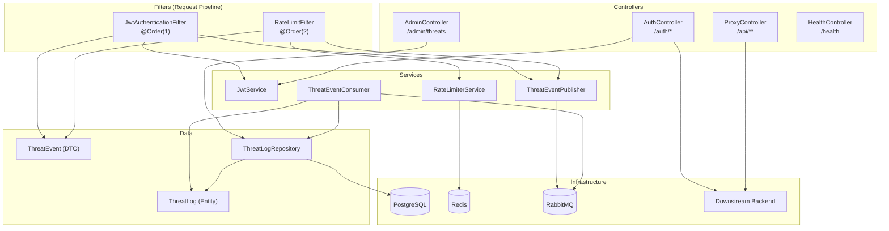

# 🛡️ EdgeShield (ShieldGate) — Complete Technical Audit

> **Generated**: 2026-07-02 | **Repository**: `Yashashv101/EdgeShield` | **Root**: `c:\Users\yasha\Documents\ShieldGate`

---

## 1. Project Identity & Purpose

**EdgeShield** (internally codenamed **ShieldGate**) is a **drop-in API Gateway** that sits as a reverse proxy in front of any existing backend application. It provides three security layers — **JWT authentication**, **distributed rate limiting**, and **async threat logging** — without requiring the downstream backend to be modified in any way.

| Attribute | Value |
|---|---|
| Group ID | `com.shieldgate` |
| Artifact ID | `shieldgate` |
| Version | `0.0.1-SNAPSHOT` |
| Java Version | 17 |
| Spring Boot | 3.4.3 |
| Default Port | `8080` |
| License | Not specified |
| Docker Image | `yashashv101/edgeshield:latest` |

### One-Sentence Summary

> EdgeShield intercepts every HTTP request headed for your backend, validates a JWT, checks an IP/user-based rate limit via Redis, proxies valid requests through, and asynchronously logs security violations (missing/invalid tokens, rate limit breaches) through RabbitMQ into PostgreSQL — all queryable via a built-in admin dashboard.

---

## 2. Tech Stack

| Layer | Technology | Version | Purpose |
|---|---|---|---|
| **Runtime** | Java | 17 | Language runtime (LTS) |
| **Framework** | Spring Boot | 3.4.3 | Web framework, DI container, auto-configuration |
| **Web** | `spring-boot-starter-web` | (managed) | Embedded Tomcat, REST controllers, servlet filters |
| **ORM / Database** | `spring-boot-starter-data-jpa` + PostgreSQL 16 | (managed) / 16 | JPA/Hibernate persistence for threat logs |
| **Cache / Rate Limiting** | `spring-boot-starter-data-redis` + Redis 7 | (managed) / 7-alpine | Distributed sliding-window rate limiter |
| **Message Queue** | `spring-boot-starter-amqp` + RabbitMQ 3 | (managed) / 3-management | Async event bus for threat log publishing |
| **JWT** | jjwt (io.jsonwebtoken) | 0.12.6 | HS256 JWT creation & validation |
| **Boilerplate** | Lombok | (managed) | Reduces Java boilerplate (getters/setters/constructors) |
| **Build** | Maven | 3.9 | Dependency management & packaging |
| **Containerization** | Docker + Docker Compose | Multi-stage | Isolated deployment of all infrastructure |
| **Frontend** | Vanilla HTML + CSS + JavaScript | — | Single-page threat dashboard (no framework) |

---

## 3. Architecture Overview

```
┌──────────────────────────────────────────────────────────────────────┐
│                           CLIENT                                     │
│                  (Browser / Postman / curl)                          │
└──────────────────────────┬───────────────────────────────────────────┘
                           │  HTTP :8080
                           ▼
┌──────────────────────────────────────────────────────────────────────┐
│                      EDGESHIELD GATEWAY                              │
│                                                                      │
│  ┌─────────────────────────────────────────────────────────────┐    │
│  │                    SERVLET FILTER CHAIN                      │    │
│  │                                                             │    │
│  │  ┌─── @Order(1) ──────────────────────────────────────┐    │    │
│  │  │         JwtAuthenticationFilter                     │    │    │
│  │  │  • Skips public paths (/auth/*, /health, /dashboard)│    │    │
│  │  │  • Extracts Bearer token                            │    │    │
│  │  │  • Validates JWT via JwtService                     │    │    │
│  │  │  • On failure → publishes ThreatEvent to RabbitMQ   │    │    │
│  │  │  • On success → sets "username" request attribute   │    │    │
│  │  └────────────────────────────────────────────────────┘    │    │
│  │                          │                                  │    │
│  │  ┌─── @Order(2) ──────────────────────────────────────┐    │    │
│  │  │         RateLimitFilter                             │    │    │
│  │  │  • Gets client key (username or IP)                 │    │    │
│  │  │  • Checks Redis counter via RateLimiterService      │    │    │
│  │  │  • On breach → publishes ThreatEvent, returns 429   │    │    │
│  │  │  • On pass → continues filter chain                 │    │    │
│  │  └────────────────────────────────────────────────────┘    │    │
│  └─────────────────────────────────────────────────────────────┘    │
│                          │                                           │
│  ┌───────────────────────────────────────────────────────────────┐  │
│  │                     CONTROLLER LAYER                          │  │
│  │                                                               │  │
│  │  AuthController ──→ /auth/login, /auth/register               │  │
│  │       Proxies credentials to downstream backend               │  │
│  │       On success → generates JWT via JwtService               │  │
│  │                                                               │  │
│  │  ProxyController ──→ /api/**                                  │  │
│  │       Reverse-proxies to TARGET_URL                           │  │
│  │                                                               │  │
│  │  AdminController ──→ /admin/threats, /admin/threats/type,     │  │
│  │                      /admin/threats/ip                         │  │
│  │       Reads threat logs from PostgreSQL                       │  │
│  │                                                               │  │
│  │  HealthController ──→ /health                                 │  │
│  │       Returns {"status": "UP"}                                │  │
│  └───────────────────────────────────────────────────────────────┘  │
│                                                                      │
│  ┌───────────────────────────────────────────────────────────────┐  │
│  │                      SERVICE LAYER                            │  │
│  │                                                               │  │
│  │  JwtService            – Generate & validate HS256 JWTs       │  │
│  │  RateLimiterService    – Redis INCR + TTL sliding window      │  │
│  │  ThreatEventPublisher  – Sends ThreatEvent → RabbitMQ         │  │
│  │  ThreatEventConsumer   – Listens RabbitMQ → saves to Postgres │  │
│  └───────────────────────────────────────────────────────────────┘  │
│                                                                      │
│  ┌──────────────────┐  ┌──────────────────┐  ┌──────────────────┐  │
│  │   PostgreSQL 16  │  │    Redis 7       │  │   RabbitMQ 3     │  │
│  │   (threat_logs)  │  │  (rate counters) │  │  (threat queue)  │  │
│  └──────────────────┘  └──────────────────┘  └──────────────────┘  │
└──────────────────────────────────────────────────────────────────────┘
                           │
                           │  HTTP (RestTemplate)
                           ▼
┌──────────────────────────────────────────────────────────────────────┐
│                    DOWNSTREAM BACKEND                                 │
│               (User's existing app on any port)                      │
│       • /login endpoint for authentication                           │
│       • /register endpoint for registration                          │
│       • All other business logic endpoints                           │
└──────────────────────────────────────────────────────────────────────┘
```

---

## 4. Directory Structure & File-by-File Descriptions

```
ShieldGate/
├── .dockerignore
├── .gitignore
├── Dockerfile
├── README.md
├── docker-compose.yml
├── pom.xml
└── src/
    └── main/
        ├── java/com/shieldgate/
        │   ├── ShieldGateApplication.java
        │   ├── config/
        │   │   ├── CorsConfig.java
        │   │   └── RabbitMQConfig.java
        │   ├── controller/
        │   │   ├── AdminController.java
        │   │   ├── AuthController.java
        │   │   ├── HealthController.java
        │   │   └── ProxyController.java
        │   ├── dto/
        │   │   └── ThreatEvent.java
        │   ├── filter/
        │   │   ├── JwtAuthenticationFilter.java
        │   │   └── RateLimitFilter.java
        │   ├── model/
        │   │   └── ThreatLog.java
        │   ├── repository/
        │   │   └── ThreatLogRepository.java
        │   └── service/
        │       ├── JwtService.java
        │       ├── RateLimiterService.java
        │       ├── ThreatEventConsumer.java
        │       └── ThreatEventPublisher.java
        └── resources/
            ├── application.yml
            ├── application-docker.yml
            └── static/dashboard/
                └── index.html
```

---

### Root-Level Files

#### [pom.xml](file:///c:/Users/yasha/Documents/ShieldGate/pom.xml)
**Maven build descriptor.** Declares the project as a Spring Boot 3.4.3 application with Java 17. Pulls in five core Spring Boot starters (`web`, `data-jpa`, `data-redis`, `amqp`, `test`), the PostgreSQL JDBC driver, the jjwt 0.12.6 JWT library (`api`, `impl`, `jackson`), and Lombok. The `spring-boot-maven-plugin` is configured to package the app as an executable fat JAR while excluding Lombok from the final artifact.

#### [Dockerfile](file:///c:/Users/yasha/Documents/ShieldGate/Dockerfile)
**Multi-stage Docker build.** Stage 1 (`maven:3.9-eclipse-temurin-17`) copies `pom.xml`, downloads dependencies offline, then copies source and runs `mvn package -DskipTests`. Stage 2 (`eclipse-temurin:17-jre-alpine`) copies the built JAR and runs it on port 8080. This produces a minimal ~200MB production image.

#### [docker-compose.yml](file:///c:/Users/yasha/Documents/ShieldGate/docker-compose.yml)
**Orchestrates 4 services.** Defines `postgres` (PostgreSQL 16 with persistent volume), `redis` (Redis 7 Alpine), `rabbitmq` (RabbitMQ 3 with management UI), and `shieldgate` (the gateway app). The gateway depends on all three infra services via health checks. Exposes port 8080. Environment variables configure `TARGET_URL`, `LOGIN_URL`, `REGISTER_URL`, `JWT_SECRET`, `RATE_LIMIT`, and service credentials. Uses `host.docker.internal` to reach the user's local backend.

#### [README.md](file:///c:/Users/yasha/Documents/ShieldGate/README.md)
**Comprehensive user-facing documentation.** Covers the architecture diagram, prerequisites, step-by-step setup (JWT secret generation, docker-compose config, starting backend, launching EdgeShield), dashboard usage, admin API endpoints, debugging tips, and an extensive FAQ for common errors.

#### [.gitignore](file:///c:/Users/yasha/Documents/ShieldGate/.gitignore)
**Git exclusions.** Ignores `target/`, IDE files (IntelliJ, Eclipse, VS Code), `.DS_Store`, log files, and a sensitive `.application.yml` file.

#### [.dockerignore](file:///c:/Users/yasha/Documents/ShieldGate/.dockerignore)
**Docker build context exclusions.** Prevents `target/`, IDE files, `.git/`, markdown files, and `.env` files from being sent to the Docker daemon during image builds.

---

### Java Source Files

---

#### [ShieldGateApplication.java](file:///c:/Users/yasha/Documents/ShieldGate/src/main/java/com/shieldgate/ShieldGateApplication.java)
**Spring Boot entry point.** The `@SpringBootApplication` annotated main class that bootstraps the entire application. It triggers component scanning across `com.shieldgate.*`, auto-configures all starters (JPA, Redis, AMQP, Web), and launches the embedded Tomcat server. Every other class in the project is discovered and wired from here.

---

### Config Layer

#### [CorsConfig.java](file:///c:/Users/yasha/Documents/ShieldGate/src/main/java/com/shieldgate/config/CorsConfig.java)
**CORS policy configuration.** Registers a `CorsFilter` bean that permits all origins (`*`), all HTTP methods, and all headers on every endpoint (`/**`). This is essential because the dashboard frontend served from `/dashboard/index.html` makes AJAX calls to `/auth/login` and `/admin/threats` on the same origin. Without this, browser CORS preflight checks would block the dashboard. Connected to: the embedded Tomcat filter chain — executes before the custom `JwtAuthenticationFilter`.

#### [RabbitMQConfig.java](file:///c:/Users/yasha/Documents/ShieldGate/src/main/java/com/shieldgate/config/RabbitMQConfig.java)
**RabbitMQ topology declaration.** Defines three beans:
1. A durable **queue** named `threat-events-queue`
2. A **direct exchange** named `threat-events-exchange`
3. A **binding** between them using routing key `threat.event`

Also registers a `Jackson2JsonMessageConverter` bean so `ThreatEvent` DTOs are serialized to JSON when published and deserialized back when consumed. Connected to: `ThreatEventPublisher` (uses the exchange/routing key constants), `ThreatEventConsumer` (listens on the queue constant).

---

### Filter Layer (The Security Gate)

#### [JwtAuthenticationFilter.java](file:///c:/Users/yasha/Documents/ShieldGate/src/main/java/com/shieldgate/filter/JwtAuthenticationFilter.java)
**First-pass security filter (`@Order(1)`).** Implements `jakarta.servlet.Filter` and intercepts every incoming HTTP request. Its logic:
1. **Public path bypass** — Requests to `/health`, `/auth/*`, `/dashboard/*`, and static assets (`.css`, `.js`, `.ico`) skip JWT validation entirely.
2. **Missing token** — If no `Authorization: Bearer <token>` header exists, it publishes a `MISSING_JWT` threat event to RabbitMQ and returns `401 Unauthorized`.
3. **Invalid token** — If the token is present but fails `JwtService.validateToken()` (expired, tampered, wrong key), it publishes an `INVALID_JWT` threat event and returns `401`.
4. **Valid token** — Extracts the username from the JWT claims and sets it as a request attribute (`username`), making it available to downstream filters and controllers.

Connected to: `JwtService` (for token validation), `ThreatEventPublisher` (for async threat logging), `RateLimitFilter` (next in chain, reads the `username` attribute set here).

#### [RateLimitFilter.java](file:///c:/Users/yasha/Documents/ShieldGate/src/main/java/com/shieldgate/filter/RateLimitFilter.java)
**Second-pass security filter (`@Order(2)`).** Executes after JWT validation. Its logic:
1. Determines a **client key**: uses the `username` request attribute (set by `JwtAuthenticationFilter`) if present, otherwise falls back to the client's raw IP address (`request.getRemoteAddr()`).
2. Calls `RateLimiterService.isRateLimited(key)` to check the Redis counter.
3. If the rate limit is exceeded, publishes a `RATE_LIMIT_EXCEEDED` threat event and returns HTTP `429 Too Many Requests`.
4. Otherwise, continues the filter chain to the controller layer.

Connected to: `RateLimiterService` (Redis-backed counter), `ThreatEventPublisher` (async logging), `JwtAuthenticationFilter` (reads its `username` attribute).

---

### Controller Layer

#### [AuthController.java](file:///c:/Users/yasha/Documents/ShieldGate/src/main/java/com/shieldgate/controller/AuthController.java)
**Authentication proxy (`/auth/login`, `/auth/register`).** Acts as a bridge between the client and the downstream backend's authentication endpoints. On login:
1. Receives `{ "username": "...", "password": "..." }` as a JSON body.
2. Uses `RestTemplate` to forward the exact body to the backend's `LOGIN_URL` (configured via `auth.login-url` property).
3. If the backend returns 2xx, EdgeShield generates a JWT via `JwtService.generateToken(username)` and returns `{ "token": "..." }` to the client.
4. If the backend returns an error, EdgeShield returns `401 Unauthorized`.

Registration works identically but against the `REGISTER_URL`. This means EdgeShield does **not** store any user credentials — it delegates authentication entirely to the downstream backend and issues its own JWT.

Connected to: `JwtService` (token generation), downstream backend (via `RestTemplate`), `application.yml` (reads `auth.login-url` and `auth.register-url`).

#### [ProxyController.java](file:///c:/Users/yasha/Documents/ShieldGate/src/main/java/com/shieldgate/controller/ProxyController.java)
**Reverse proxy (`/api/**`).** Catches all requests under the `/api/` prefix. It strips the `/api` prefix from the URI, appends the remainder to `TARGET_URL`, and forwards the request using `RestTemplate.exchange()` preserving the original HTTP method (GET, POST, PUT, DELETE, etc.). Returns the downstream response body and status directly to the client.

> [!WARNING]
> The current implementation does **not** forward request headers or body to the downstream backend. The `RestTemplate.exchange()` call passes `null` for the request entity, which means POST/PUT bodies and headers like `Content-Type` are lost. This is a known limitation.

Connected to: `application.yml` (reads `proxy.target-url`), downstream backend (via `RestTemplate`).

#### [AdminController.java](file:///c:/Users/yasha/Documents/ShieldGate/src/main/java/com/shieldgate/controller/AdminController.java)
**Threat log query API (`/admin/threats`).** Exposes three JWT-protected GET endpoints:
- `GET /admin/threats` — Returns all threat logs ordered by timestamp descending.
- `GET /admin/threats/type?type=INVALID_JWT` — Filters by threat type.
- `GET /admin/threats/ip?ip=192.168.1.1` — Filters by source IP.

Connected to: `ThreatLogRepository` (reads from PostgreSQL), `JwtAuthenticationFilter` (these endpoints require a valid JWT since they don't match any public path).

#### [HealthController.java](file:///c:/Users/yasha/Documents/ShieldGate/src/main/java/com/shieldgate/controller/HealthController.java)
**Simple health check (`GET /health`).** Returns `{ "status": "UP" }` with HTTP 200. This is a public endpoint (excluded from JWT validation in `JwtAuthenticationFilter.isPublicPath()`). Used for container health checks and monitoring.

Connected to: `JwtAuthenticationFilter` (whitelisted in `isPublicPath()`).

---

### DTO Layer

#### [ThreatEvent.java](file:///c:/Users/yasha/Documents/ShieldGate/src/main/java/com/shieldgate/dto/ThreatEvent.java)
**Data Transfer Object for threat events.** A `Serializable` POJO with five fields: `threatType`, `sourceIp`, `username`, `requestPath`, and `timestamp`. Uses Lombok's `@Getter`, `@Setter`, `@AllArgsConstructor`, `@NoArgsConstructor`. The 4-arg constructor (without `timestamp`) is used by the filters — the `timestamp` is typically set to `null` at publish time and populated by the consumer or database. This DTO travels over RabbitMQ as a JSON message, acting as the contract between the publisher (filters) and the consumer (database writer).

Connected to: `JwtAuthenticationFilter` (creates instances), `RateLimitFilter` (creates instances), `ThreatEventPublisher` (serializes to RabbitMQ), `ThreatEventConsumer` (deserializes from RabbitMQ), `RabbitMQConfig` (Jackson2JsonMessageConverter handles ser/deser).

---

### Model Layer

#### [ThreatLog.java](file:///c:/Users/yasha/Documents/ShieldGate/src/main/java/com/shieldgate/model/ThreatLog.java)
**JPA entity mapped to `threat_logs` table.** Has a database-generated `Long id` (auto-increment identity strategy) and the same five fields as `ThreatEvent`: `threatType`, `sourceIp`, `username`, `requestPath`, `timestamp`. Hibernate auto-creates/updates this table thanks to `ddl-auto: update` in `application.yml`. Lombok handles getters, setters, and constructors.

Connected to: `ThreatEventConsumer` (creates and saves instances), `ThreatLogRepository` (CRUD interface), `AdminController` (reads and returns instances).

---

### Repository Layer

#### [ThreatLogRepository.java](file:///c:/Users/yasha/Documents/ShieldGate/src/main/java/com/shieldgate/repository/ThreatLogRepository.java)
**Spring Data JPA repository.** Extends `JpaRepository<ThreatLog, Long>` providing standard CRUD plus three custom query methods derived from method names:
- `findAllByOrderByTimestampDesc()` — All logs, newest first.
- `findByThreatType(String)` — Filter by type.
- `findBySourceIp(String)` — Filter by IP.

Connected to: `AdminController` (reads data), `ThreatEventConsumer` (writes data), PostgreSQL `threat_logs` table.

---

### Service Layer

#### [JwtService.java](file:///c:/Users/yasha/Documents/ShieldGate/src/main/java/com/shieldgate/service/JwtService.java)
**JWT creation and validation.** Generates HMAC-SHA (HS256) signed JWTs using the `jwt.secret` config property and validates them by parsing signed claims. The token contains `subject` (username), `issuedAt`, and `expiration` (configured via `jwt.expiration`, default 3,600,000ms = 1 hour). Uses the jjwt 0.12.6 modern builder API (`Jwts.builder()` / `Jwts.parser()`).

Connected to: `AuthController` (calls `generateToken`), `JwtAuthenticationFilter` (calls `validateToken`), `application.yml` (reads `jwt.secret` and `jwt.expiration`).

#### [RateLimiterService.java](file:///c:/Users/yasha/Documents/ShieldGate/src/main/java/com/shieldgate/service/RateLimiterService.java)
**Redis-backed distributed rate limiter.** Implements a sliding window counter pattern:
1. Constructs a Redis key as `rate:<clientKey>` (where clientKey is username or IP).
2. Calls `INCR` on the key — Redis atomically increments the counter.
3. If this is the first request (`count == 1`), sets a TTL of `windowSeconds` (default 60s).
4. Returns `true` if the count exceeds `maxRequests` (default 100).

This ensures at most 100 requests per client per 60-second window across all instances. The TTL-based expiration automatically resets the window.

Connected to: `RateLimitFilter` (calls `isRateLimited`), Redis (via `StringRedisTemplate`), `application.yml` (reads `ratelimit.max-requests` and `ratelimit.window-seconds`).

#### [ThreatEventPublisher.java](file:///c:/Users/yasha/Documents/ShieldGate/src/main/java/com/shieldgate/service/ThreatEventPublisher.java)
**RabbitMQ message producer.** Sends `ThreatEvent` DTOs to the `threat-events-exchange` with routing key `threat.event`. Wraps the publish call in a try-catch so that RabbitMQ failures don't crash the request pipeline — a warning is printed to stderr instead.

Connected to: `JwtAuthenticationFilter` (calls `publish`), `RateLimitFilter` (calls `publish`), `RabbitMQConfig` (uses exchange/routing key constants), RabbitMQ server.

#### [ThreatEventConsumer.java](file:///c:/Users/yasha/Documents/ShieldGate/src/main/java/com/shieldgate/service/ThreatEventConsumer.java)
**RabbitMQ message consumer.** Annotated with `@RabbitListener(queues = "threat-events-queue")`, this service automatically listens for `ThreatEvent` messages. When a message arrives, it maps the DTO fields to a new `ThreatLog` JPA entity and persists it to PostgreSQL via `ThreatLogRepository.save()`. This decouples the security violation detection (in filters) from the database write (here), ensuring request latency isn't impacted by DB operations.

Connected to: `RabbitMQConfig` (listens on queue constant), `ThreatLogRepository` (persists data), `ThreatEvent` DTO (deserialized input), `ThreatLog` model (output entity).

---

### Configuration Files

#### [application.yml](file:///c:/Users/yasha/Documents/ShieldGate/src/main/resources/application.yml)
**Primary Spring configuration (local dev profile).** Configures:
- **Server**: port 8080
- **PostgreSQL**: `jdbc:postgresql://localhost:5432/shieldgate`, user `postgres`
- **JPA**: Hibernate auto DDL update, PostgreSQL dialect
- **Redis**: localhost:6379
- **RabbitMQ**: localhost:5672, guest/guest
- **JWT**: secret from `$JWT_SECRET` env var (fallback: dev key), expiration 3,600,000ms (1 hour)
- **Rate Limit**: max 100 requests per 60-second window (overridable via `$RATE_LIMIT`)
- **Proxy**: target URL from `$TARGET_URL` (fallback: `http://localhost:9090`)
- **Auth**: login/register URLs from `$LOGIN_URL` / `$REGISTER_URL`

#### [application-docker.yml](file:///c:/Users/yasha/Documents/ShieldGate/src/main/resources/application-docker.yml)
**Docker profile overrides.** Activated when `SPRING_PROFILES_ACTIVE=docker`. Overrides only the infrastructure hostnames:
- PostgreSQL: `postgres:5432` (Docker service name)
- Redis: `redis` (Docker service name)
- RabbitMQ: `rabbitmq` (Docker service name)
- Credentials from env vars: `$POSTGRES_PASSWORD`, `$RABBITMQ_USER`, `$RABBITMQ_PASS`

All other settings are inherited from the base `application.yml`.

---

### Frontend

#### [index.html](file:///c:/Users/yasha/Documents/ShieldGate/src/main/resources/static/dashboard/index.html)
**Single-page threat monitoring dashboard (991 lines).** A self-contained HTML file with inline CSS and JavaScript — no build step, no framework dependencies. Served at `/dashboard/index.html`. Features:

**Login Screen:**
- Username/password form that calls `POST /auth/login`
- Stores the returned JWT in `sessionStorage` (key: `sg_token`)
- Shows error messages for invalid credentials or server unreachable

**Dashboard (shown after login):**
- **Stats cards**: 4 cards showing Total Threats, Missing JWT, Invalid JWT, Rate Limited counts
- **Filter bar**: Type filter buttons (All / Missing JWT / Invalid JWT / Rate Limited) + IP search input
- **Sortable table**: Columns for ID, Type (with color-coded badges), Source IP, User, Path, Time
- **Auto-refresh toggle**: Polls `GET /admin/threats` every 5 seconds when enabled
- **Session bar**: Shows authenticated username
- **Auto-logout**: On 401 response (expired token), forces re-login with "Session expired" message

**Design:** Dark theme with glassmorphism, Inter font, ambient gradient glows, micro-animations on hover. Fully responsive (breakpoints at 900px and 600px).

Connected to: `AuthController` (login API), `AdminController` (threat log API), `JwtAuthenticationFilter` (the `/dashboard/` path is whitelisted).

---

## 5. Request Flow — Detailed Trace

### Flow A: Login (Unauthenticated)

```
Client                   EdgeShield                        Your Backend
  │                          │                                  │
  │  POST /auth/login        │                                  │
  │  { username, password }  │                                  │
  │ ─────────────────────►   │                                  │
  │                          │                                  │
  │     [JwtAuthFilter]      │                                  │
  │     path = /auth/login   │                                  │
  │     isPublicPath() = ✓   │                                  │
  │     → SKIP JWT check     │                                  │
  │                          │                                  │
  │     [RateLimitFilter]    │                                  │
  │     key = IP (no user)   │                                  │
  │     Redis INCR rate:IP   │                                  │
  │     count ≤ 100 → PASS   │                                  │
  │                          │                                  │
  │     [AuthController]     │                                  │
  │     POST to LOGIN_URL ───────────────────────────────────►  │
  │                          │                                  │
  │                          │  ◄─── 200 OK ────────────────── │
  │                          │                                  │
  │     JwtService.generate  │                                  │
  │     Token(username)      │                                  │
  │                          │                                  │
  │  ◄─── 200 { token }     │                                  │
```

### Flow B: Authenticated API Request (Happy Path)

```
Client                   EdgeShield                                 Your Backend
  │                          │                                           │
  │  GET /api/jobs           │                                           │
  │  Authorization: Bearer X │                                           │
  │ ─────────────────────►   │                                           │
  │                          │                                           │
  │     [JwtAuthFilter]      │                                           │
  │     path = /api/jobs     │                                           │
  │     isPublicPath() = ✗   │                                           │
  │     Extract token X      │                                           │
  │     JwtService.validate  │                                           │
  │     → username = "john"  │                                           │
  │     setAttribute(user)   │                                           │
  │                          │                                           │
  │     [RateLimitFilter]    │                                           │
  │     key = "john"         │                                           │
  │     Redis INCR rate:john │                                           │
  │     count ≤ 100 → PASS   │                                           │
  │                          │                                           │
  │     [ProxyController]    │                                           │
  │     Strip /api prefix    │                                           │
  │     → GET TARGET_URL/jobs ──────────────────────────────────────────► │
  │                          │                                           │
  │                          │  ◄─── 200 { jobs data } ──────────────── │
  │                          │                                           │
  │  ◄─── 200 { jobs data } │                                           │
```

### Flow C: Missing JWT (Threat Logged)

```
Client                   EdgeShield                  RabbitMQ           PostgreSQL
  │                          │                          │                    │
  │  GET /api/jobs           │                          │                    │
  │  (no Authorization)      │                          │                    │
  │ ─────────────────────►   │                          │                    │
  │                          │                          │                    │
  │     [JwtAuthFilter]      │                          │                    │
  │     No Bearer header     │                          │                    │
  │                          │                          │                    │
  │     ThreatEventPublisher │                          │                    │
  │     .publish(MISSING_JWT)─────────────────────────► │                    │
  │                          │                          │                    │
  │                          │     [ThreatEventConsumer] │                    │
  │                          │     ◄── consume event ── │                    │
  │                          │                          │                    │
  │                          │     ThreatLogRepo.save() ────────────────►   │
  │                          │                          │                    │
  │  ◄─── 401 { error }     │                          │                    │
```

### Flow D: Rate Limit Exceeded

```
Client                   EdgeShield                  RabbitMQ           Redis
  │                          │                          │                 │
  │  GET /api/resource       │                          │                 │
  │  Authorization: Bearer X │                          │                 │
  │ ─────────────────────►   │                          │                 │
  │                          │                          │                 │
  │     [JwtAuthFilter] ✓    │                          │                 │
  │                          │                          │                 │
  │     [RateLimitFilter]    │                          │                 │
  │     INCR rate:john ──────────────────────────────────────────────►   │
  │                          │                          │                 │
  │     count = 101 > 100    │  ◄────────────────────────────── 101 ── │
  │     → RATE LIMITED       │                          │                 │
  │                          │                          │                 │
  │     ThreatEventPublisher │                          │                 │
  │     .publish(RATE_LIMIT) ──────────────────────►    │                 │
  │                          │                          │                 │
  │  ◄─── 429 { error }     │                          │                 │
```

### Flow E: Dashboard Login + View Threats

```
Browser                  EdgeShield
  │                          │
  │  GET /dashboard/index.html                       (served as static file)
  │ ─────────────────────►   │
  │  ◄─── 200 HTML page     │
  │                          │
  │  [User fills login form] │
  │                          │
  │  POST /auth/login        │  → proxies to backend → gets 200
  │ ─────────────────────►   │  → generates JWT
  │  ◄─── { token }         │
  │                          │
  │  [JS stores token in     │
  │   sessionStorage]        │
  │                          │
  │  GET /admin/threats      │
  │  Authorization: Bearer T │
  │ ─────────────────────►   │
  │                          │
  │  [JwtAuthFilter validates]
  │  [RateLimitFilter passes]│
  │  [AdminController reads  │
  │   from ThreatLogRepo]    │
  │                          │
  │  ◄─── 200 [threat logs]  │
  │                          │
  │  [JS renders table,      │
  │   stats cards, filters]  │
```

---

## 6. Configuration & Environment Variables

| Variable | Default | Description |
|---|---|---|
| `TARGET_URL` | `http://localhost:9090` | Base URL of the downstream backend for proxy forwarding |
| `LOGIN_URL` | `http://localhost:9090/login` | Backend's login endpoint (receives credentials, returns 2xx on success) |
| `REGISTER_URL` | `http://localhost:9090/register` | Backend's registration endpoint |
| `JWT_SECRET` | `local-dev-secret-key-change-this-in-production!!` | HMAC-SHA signing key for JWTs (min 32 bytes recommended) |
| `RATE_LIMIT` | `100` | Maximum requests per client per 60-second window |
| `SPRING_PROFILES_ACTIVE` | *(none)* | Set to `docker` when running inside Docker Compose |
| `POSTGRES_PASSWORD` | `changeme` | Password for EdgeShield's own PostgreSQL instance |
| `RABBITMQ_USER` | `guest` | RabbitMQ username |
| `RABBITMQ_PASS` | `guest` | RabbitMQ password |

---

## 7. API Endpoint Reference

| Method | Path | Auth | Description |
|---|---|---|---|
| `POST` | `/auth/login` | ❌ Public | Proxies credentials to backend, returns JWT |
| `POST` | `/auth/register` | ❌ Public | Proxies registration to backend, returns JWT |
| `GET` | `/health` | ❌ Public | Returns `{ "status": "UP" }` |
| `GET` | `/dashboard/index.html` | ❌ Public | Serves the threat monitoring dashboard |
| `GET` | `/admin/threats` | ✅ JWT | All threat logs, newest first |
| `GET` | `/admin/threats/type?type=<TYPE>` | ✅ JWT | Threat logs filtered by type |
| `GET` | `/admin/threats/ip?ip=<IP>` | ✅ JWT | Threat logs filtered by source IP |
| `ANY` | `/api/**` | ✅ JWT | Reverse proxy to `TARGET_URL` |

**Threat Types**: `MISSING_JWT`, `INVALID_JWT`, `RATE_LIMIT_EXCEEDED`

---

## 8. Database Schema

EdgeShield uses a single table, auto-created by Hibernate:

### Table: `threat_logs`

| Column | Type | Constraints | Description |
|---|---|---|---|
| `id` | `BIGSERIAL` | PRIMARY KEY, AUTO-INCREMENT | Unique threat log identifier |
| `threat_type` | `VARCHAR(255)` | | One of: `MISSING_JWT`, `INVALID_JWT`, `RATE_LIMIT_EXCEEDED` |
| `source_ip` | `VARCHAR(255)` | | Client IP address (from `request.getRemoteAddr()`) |
| `username` | `VARCHAR(255)` | | Username from JWT or `"unknown"` |
| `request_path` | `VARCHAR(255)` | | The URI path that triggered the threat |
| `timestamp` | `TIMESTAMP` | | When the threat event occurred |

> [!NOTE]
> Column names are Hibernate's default snake_case mapping of the Java field names. No explicit `@Column` annotations are used.

---

## 9. How to Run

### Local Development (No Docker)

Prerequisites: PostgreSQL, Redis, and RabbitMQ running locally.

```bash
# Set environment variables
export JWT_SECRET=$(openssl rand -base64 32)
export TARGET_URL=http://localhost:9090

# Build and run
./mvnw spring-boot:run
```

### Docker Compose (Recommended)

```bash
# 1. Start your backend app on its port (e.g., 9090)
# 2. Configure docker-compose.yml with your JWT_SECRET and TARGET_URL
# 3. Launch
docker compose up -d

# View logs
docker logs -f shieldgate-app

# Full reset
docker compose down -v
```

---

## 10. Key Design Decisions

| Decision | Rationale |
|---|---|
| **Servlet Filters over Spring Security** | Keeps the gateway lightweight — no Security filter chain, no `UserDetailsService`, no sessions. Just two ordered filters doing JWT + rate limit checks. |
| **RabbitMQ for threat logging** | Decouples the critical request path (JWT validation + proxying) from slow database writes. Filters fire-and-forget a message; a separate consumer persists it asynchronously. |
| **Redis for rate limiting** | Enables distributed rate limiting across multiple gateway instances (horizontal scaling). Redis `INCR` + `EXPIRE` provides an atomic, thread-safe counter. |
| **No user storage** | EdgeShield delegates all authentication to the downstream backend. It only issues its own JWT after the backend confirms credentials. Zero schema coupling. |
| **Single-file dashboard** | No build tools, no npm, no bundling. The entire dashboard is one HTML file with inline CSS/JS. Served as a static asset by Spring Boot. Simplifies deployment. |
| **`host.docker.internal`** | Allows the Docker container to reach services running on the host machine (the user's backend). Standard Docker networking pattern. |

---

## 11. Dependency Graph (Component Relationships)



---

## 12. Known Limitations & Areas for Improvement

| Area | Current State | Potential Improvement |
|---|---|---|
| **Proxy request forwarding** | `ProxyController` passes `null` as the request entity — request body and headers are not forwarded | Forward the full `HttpEntity` with body and headers |
| **Error handling** | `RestTemplate` errors are caught generically; no structured error responses from proxy | Use `WebClient` or handle specific HTTP status codes |
| **Rate limit scope** | Rate limiting applies to all endpoints equally (including public ones) | Make rate limiting configurable per-endpoint |
| **No Spring Security** | Custom servlet filters handle auth — works but misses Spring Security ecosystem (method security, CSRF, etc.) | Consider integrating Spring Security for more complex auth needs |
| **No tests** | No unit or integration tests exist | Add tests for filters, services, and controllers |
| **Logging** | Uses `System.err.println` for warnings | Use SLF4J / Logback (already available via Spring Boot) |
| **JWT claims** | Only `subject` (username) is stored in JWT | Add roles, permissions, issuer, audience for richer access control |
| **Dashboard security** | Dashboard HTML is public; only the API calls are JWT-protected | Add a proper authentication gate at the HTML level |
| **Timestamp in ThreatEvent** | The 4-arg constructor leaves `timestamp` as `null`; consumer saves it as-is | Set `timestamp = LocalDateTime.now()` at creation or in the consumer |

---

*This audit covers every file, class, method, and configuration in the EdgeShield repository as of 2026-07-02.*
